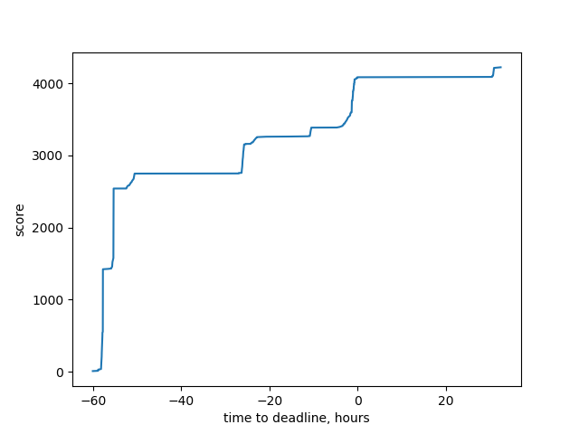

### Total time
```sql
SELECT
    SUM((extra->>'solver_time')::real),
    SUM((extra->>'validator_time')::real)
FROM solutions
```
```
76 hours for solvers
18 hours for Chrome
```

### CPU time by solver during the contest
```sql
SELECT
    scent,
    count(*),
    SUM((extra->>'solver_time')::real)::int AS total_time
FROM solutions
WHERE time < TIMESTAMPTZ '2019-06-24 10:00:00+00'
GROUP BY scent
ORDER BY total_time
```
```
+----------------------------------+---------+--------------+
| scent                            | count   | total_time   |
|----------------------------------+---------+--------------|
| treaker 1 squared                | 1       | 3            |
| rotator 1 p23                    | 9       | 4            |
| greedy 0                         | 7       | 11           |
| greedy 1'                        | 4       | 41           |
| insect2                          | 21      | 68           |
| boosty 0.9 cpp                   | 1       | 146          |
| rotator 1 bonus'                 | 4       | 265          |
| rotator 2 p23                    | 25      | 270          |
| driller 1                        | 9       | 438          |
| greedy 1                         | 300     | 702          |
| insect3 extension                | 131     | 1847         |
| boosty 0.1                       | 12      | 2335         |
| tree beam v2 d=5                 | 58      | 3806         |
| tweaker 1 squared                | 127     | 5988         |
| greedy 2                         | 323     | 6369         |
| tweaker 1 squared drill teleport | 102     | 6691         |
| greedy 3                         | 358     | 7149         |
| tree beam d=5                    | 300     | 8357         |
| tweaker 1 squared drill          | 183     | 8419         |
| driller 1 lined                  | 207     | 11168        |
| boosty 1 rotate                  | 20      | 12051        |
| tweaker 1 squared teleport       | 232     | 14865        |
| rotator 1                        | 310     | 15847        |
| insect1                          | 264     | 18595        |
| boosty 0.9 rotate                | 32      | 25389        |
| rotator 1 bonus                  | 372     | 31199        |
| greedy beam d=5                  | 301     | 32298        |
| manual (Fj)                      | 5       | <null>       |
| manual (vlads)                   | 8       | <null>       |
| manual (Julie)                   | 5       | <null>       |
+----------------------------------+---------+--------------+
```

### CPU time needed to finish running our solvers after the contest
```sql
SELECT
    scent,
    count(*),
    SUM((extra->>'solver_time')::real)::int AS total_time
FROM solutions
WHERE time >= TIMESTAMPTZ '2019-06-24 10:00:00+00'
GROUP BY scent
ORDER BY total_time
```
```
+----------------------------------+---------+--------------+
| scent                            | count   | total_time   |
|----------------------------------+---------+--------------|
| tweaker 1 squared teleport       | 69      | 3059         |
| tweaker 1 squared                | 174     | 3856         |
| tweaker 1 squared drill          | 121     | 4299         |
| tweaker 1 squared drill teleport | 210     | 11371        |
| insect3 extension                | 171     | 12440        |
| tree beam v2 d=5                 | 243     | 25087        |
+----------------------------------+---------+--------------+
```

### Best solutions during contest
(produced by `production/stats.py`)
```
  ,-- #solutions
  |   ,-- #unique best
  |   |   ,-- #shared best
  |   |   |    scent
  |   |   |     |
 19   2        boosty 1 rotate
206  10   1    driller 1 lined
297       2    greedy 3
299  65        greedy beam d=5
 61  57        insect1
 28   7        insect3 extension
  2   1        manual (vlads)
294   2   4    rotator 1
298  14   3    rotator 1 bonus
 81   7   3    tree beam d=5
 54   4   3    tree beam v2 d=5
126   9  18    tweaker 1 squared
181  26  12    tweaker 1 squared drill
100  11  13    tweaker 1 squared drill teleport
225  49  19    tweaker 1 squared teleport
```

### Best solutions after completing all solver runs
(produced by `production/stats.py`)
```
  ,-- #solutions
  |   ,-- #unique best
  |   |   ,-- #shared best
  |   |   |    scent
  |   |   |     |
 19   2        boosty 1 rotate
206   9   1    driller 1 lined
297       2    greedy 3
299  53        greedy beam d=5
 61  50        insect1
 80  29        insect3 extension
  2   1        manual (vlads)
294   1   3    rotator 1
298   7   3    rotator 1 bonus
 81       8    tree beam d=5
292  17   8    tree beam v2 d=5
300   5  43    tweaker 1 squared
298   6  34    tweaker 1 squared drill
298  18  35    tweaker 1 squared drill teleport
294  16  43    tweaker 1 squared teleport
```

### Score over time
I'm using our own best scores for normalization, so this data could be inaccurate.
(produced by `production/stats.py`)


See that huge bump just before the deadline? That's [student syndrome](https://en.wikipedia.org/wiki/Student_syndrome)!